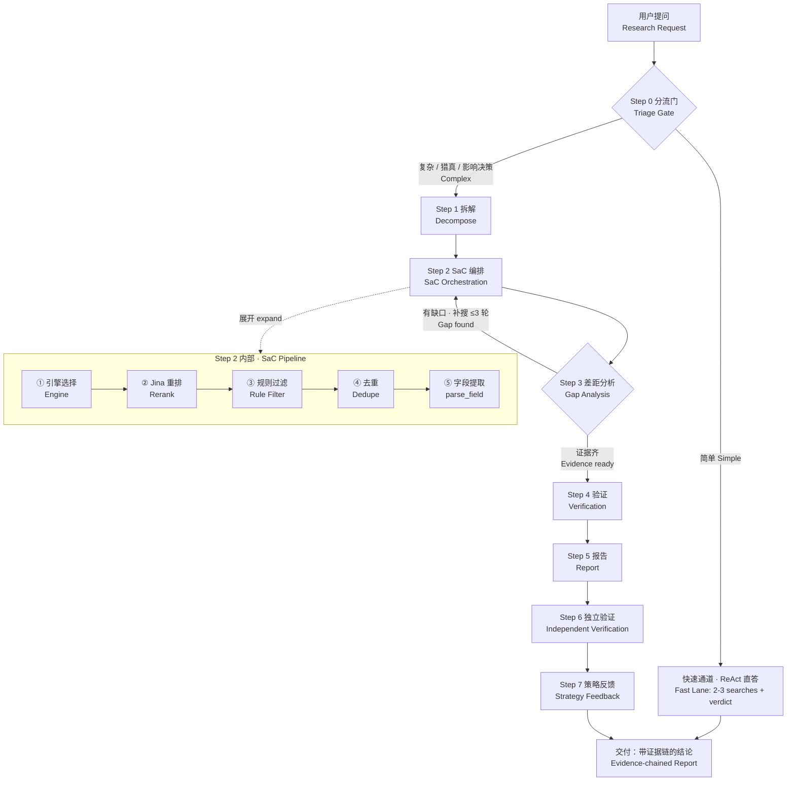

# Orion Research（猎真）

> **让 AI 帮你调研时，给你的不是"答案"，而是"带证据链的结论"。**

[](https://github.com/yangclay/orion-research)
[](https://github.com/yangclay/orion-research/blob/master/LICENSE)

## 这是给谁的

你正在用 AI Agent（Claude / GPT / 各类 agent 框架）做调研、查资料、写报告。你是不是遇到过这些情况：

- **AI 一本正经地编**：给了一个看起来很专业的数字，但来源其实是它自己编的
- **搜到的全是垃圾**：中文搜索结果 top 10 全是百度文库、教育网站的拼凑内容
- **信息是过时的**：AI 用 2023 年的资料回答你 2026 年的问题
- **找不到出处**：AI 说"据某报告显示"，但你点开发现原文根本不支持这个结论
- **矛盾被忽略**：两个来源说法相反，AI 默默选了一个，不告诉你

**问题不在 AI 不聪明，在于它缺少一套"调研方法论"。** 它像一个刚入行的实习生——搜索很快，但不知道什么是可信来源、怎么交叉验证、怎么识别软文。

Orion Research 就是给 AI 装上这套方法论。

## 装了之后，AI 会怎么做

同样一句"帮我调研一下 X"，装了 Orion Research 的 AI 会：

0. **先分流，不小题大做**：简单事实直接答（快速通道），复杂问题才启动完整七步（深度通道）
1. **拆问题**：把大问题拆成几个子问题，逐个击破
2. **多引擎搜索**：不止搜一遍，而是换多个搜索引擎交叉找
3. **查缺口**：证据不够就定向补搜（最多 3 轮），够就停——不盲目搜满固定轮数
4. **给来源分级**：每个结论标注可信度 A/B/C/D（A=一手权威来源，D=软文/可疑）
5. **识别垃圾内容**：自动识别 SEO 农场、拼凑文、营销软文并降权；检查时效性，过时的会提醒
6. **暴露矛盾**：不同来源冲突时，把冲突明明白白摆出来，而不是悄悄选一个
7. **自证清白**：报告写完后再用确定性规则独立复核一遍——每个结论附真实链接，你点开就能验证

**最终交付的是一份"带证据链的调研报告"**，不是一段可能编造的小作文。

## 快速开始

### 安装（任选你的 Agent 环境）

**通用：一条命令装到所有主流 Agent（Claude Code / Codex / OpenClaw / Cursor 等）**

```bash
npx skills add yangclay/orion-research
```

自动检测你已安装的 Agent 并分发到对应 skills 目录。也可手动安装：

**OpenClaw**

```bash
openclaw skills install git:yangclay/orion-research@main
```

**OpenAI Codex**

```bash
mkdir -p ~/.codex/skills/orion-research
cp -r SKILL.md references/ scripts/ gotchas/ evals/ ~/.codex/skills/orion-research/
```

**Anthropic Claude / Claude Code**

```bash
mkdir -p ~/.claude/skills/orion-research
cp -r SKILL.md references/ scripts/ gotchas/ evals/ ~/.claude/skills/orion-research/
```

**Hermes Agent**

```bash
git clone https://github.com/yangclay/orion-research.git \
  ~/.hermes/profiles/<你的profile>/skills/orion-research
```

> 其他 Agent（OpenCode / Cursor / Windsurf / Gemini CLI 等）及 WorkBuddy 特殊适配见 [Agent 兼容矩阵](references/agent-compatibility.md)。

### 使用

装好之后不需要学习任何新东西——**正常向你的 AI 提问即可**。当问题涉及调研、对比、查证时，它会被自动触发：

```
"深度调研一下 XX 公司靠不靠谱"
"对比 A 和 B 哪个更适合我们"
"查一下 2026 年 XX 行业的真实情况"
```

> 简单事实查询（"今天几号"、"XX 的定义是什么"）不会触发，避免小题大做。

## 工作流



## 它和普通 AI 搜索的区别

| | 普通 AI 搜索 | Orion Research |
|---|---|---|
| 搜索 | 搜 1-2 次 | 多引擎交叉，中文生态专项覆盖（知乎/公众号/百度） |
| 来源判断 | 基本不判断 | A/B/C/D 四级分级，软文自动识别 |
| 时效性 | 常忽略 | 强制检查，过时信息标注 |
| 引用 | 可能有，可能编 | 每个结论附可点击的真实链接 |
| 矛盾 | 悄悄选一个 | 明示冲突，交给你判断 |
| 深度 | 一次到位 | 有缺口自动补搜（最多 3 轮） |
| 结论可信度 | 凭运气 | 系统化验证，伪独立来源/SEO 农场被拦截 |

## 技术特点（给开发者）

- **SaC 五段式管道**：引擎选择 → Jina 重排 → 规则过滤 → 去重 → 字段提取，搜索全程可编程
- **5 个核心 Gotcha**：伪独立来源、SEO 农场、时效性、引用不支撑、矛盾静默——每次调研强制检测
- **中文生态专项**：百度系结果聚类、SerpAPI 百度引擎、软文识别规则（实测沉淀）
- **确定性验证**：Step 6 用规则复核，不依赖"用 AI 验证 AI"
- **兼容**：Hermes Agent skill 格式，标准 SKILL.md + references 结构

## 验证记录

- 2026-08-13 v3.1 全链路实测：中文语境调研（触发伪独立来源 + SEO 农场识别）、AI 营销工具对比（发现 n8n vs Zapier 90% 成本差距）
- 5 个 eval 覆盖：LLM 定价时效性、营销工具利益冲突、软件 SEO 过滤、财报来源验证、统计溯源

## License

MIT
